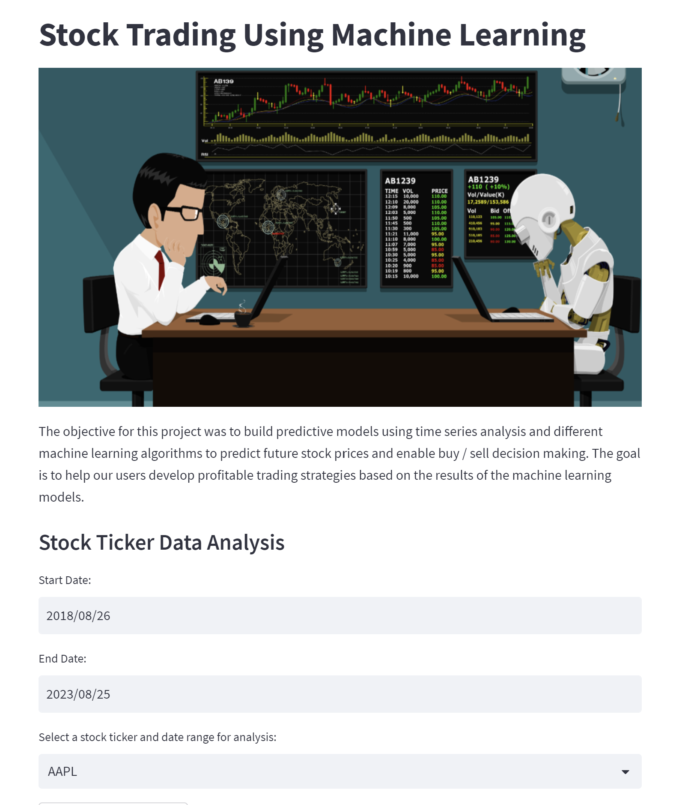

# P3.ML_Trading

UCB FinTech Bootcamp Project 3 : Stock Trading using Machine Learning

## Project Overview & Objective

The objective for this project was to build predictive models using time series analysis and different machine learning algorithms to predict future stock prices and enable buy / sell decision making. The goal is to help our users develop profitable trading strategies based on the results of the machine learning models.

This application is built using Python pulling historical stock data from yfinance and uses various technical indicators and machine learning models to optimize trading strategies.  It also includes a web-based interface enabled using Streamlit and also has an alpacas api integration which allows for automatic execution of orders and paper trading mode which provides a simulated trading environment where users can practice trading without using real money.  


## Definitions
Algorithmic trading relies on computer programs that execute algorithms to automate some or all elements of a trading strategy. Algorithms are a sequence of steps or rules designed to achieve a goal. They can take many forms and facilitate optimization throughout the investment process, from idea generation to asset allocation, trade execution, and risk management.

Machine learning (ML) involves algorithms that learn rules or patterns from data to achieve a goal such as minimizing a prediction error. 
We will illustrate how to apply ML algorithms ranging from linear models to recurrent neural networks (RNNs) to market and fundamental data and generate tradeable signals.

Technical-Trading-Bot (Future Release)
Trading Bot built using the Alpaca API in Python. 

Indicators used for Signal Generation: ATR, DEMA, EFI, EMA, EMV, Force Index, RSI, SMA_Fast, SMA_Slow, SSMA, TEMA, TRIMA, StochRSI, and Stochastic Oscillator.

## The Machine Learning Workflow
Developing an ML solution requires a systematic approach to maximize the chances of success while proceeding efficiently. It is also important to make the process transparent and replicable to facilitate collaboration, maintenance, and subsequent refinements.

The process is iterative throughout but these steps were followed:
1. Data Collection 
1. Data Preprocessing
1. Feature Engineering
1. Label Generation
1. Model Selection
1. Model Training
1. Model Evaluation
1. Model Deployment


## Modeling
The following process has been followed to test and select the most suitable models:

1. Data Loading
      Prepared Train/Test datasets were loaded from saved files. Please see the Data Preparation README for details on the preparation of the datasets.

2. Model Training
   Sci-Kit Learn Modeling
   An initial set of Machine Learning models were built using six different packages from the Scikit-Learn library:
      - AdaBoost Classifier [AbC-3Y-7030](https://github.com/LUTOV001/P2_ML_AlgoTrade/blob/main/6_luistorres/AbC-3Y-7030.ipynb)
      - Decision Tree Classifier [index_info_updated_MS](https://github.com/LUTOV001/P2_ML_AlgoTrade/blob/main/5_michellesilver/index_info_updated_MS.ipynb)
      - Logistic Regression [LogReg-3Y7030](https://github.com/LUTOV001/P2_ML_AlgoTrade/blob/main/6_luistorres/LogReg-3Y7030.ipynb)
      - Long Short-Term Memory (LTSM) Neural Network [timeseries using lstm](https://github.com/LUTOV001/P2_ML_AlgoTrade/blob/main/1_malikaajmera/timeseries%20using%20lstm.ipynb)
      - Random Forest Classifier [RSI_FINAL](https://github.com/LUTOV001/P2_ML_AlgoTrade/blob/main/1_malikaajmera/RSI_FINAL.ipynb)
      - SVM Classifier [spyp2ml](https://github.com/LUTOV001/P2_ML_AlgoTrade/blob/main/2_mattglasgow/spyp2ml.ipynb)
      
    
3. Model Performance/Selection
    Models were evaluated using accuracy score and plotting of returns being the primary metrics.
      Foundational Model
      - Support Vector Machines [svm_model](https://github.com/LUTOV001/P3.ML_Trading/blob/main/machine_learning.py)


## Technologies

Programming Languages: Python 3.7.13 


Libraries: 
- Pandas - A Python library that is used for data manipulation, analysis, and visualization. 
- Streamlit - an open-source Python library that is designed to create custom web applications for machine learning and data science projects. It allows you to turn your data scripts into interactive web applications with just a few lines of code, making it easier to share and visualize your results with others.
- Sklearn - also known as Scikit-learn, which is a popular machine learning library in Python that provides a wide range of tools and algorithms for machine learning tasks such as classification, regression, clustering, and dimensionality reduction.
- Prophet - forecasting tool developed by Facebook's Core Data Science team designed to provide automated and customizable time series forecasting for various applications. 
- Plotly - a data visualization library that allows you to create interactive and publication-quality visualizations in Python.
- Alpaca_trade_api - Alpaca is a technology-focused brokerage that offers a commission-free trading platform and an API (Application Programming Interface) for developers to build and automate trading strategies. The Alpaca Trade API allows developers to access real-time market data, execute trades, manage portfolios, and more programmatically.
- yfinance - a Python library that provides a simple interface to retrieve historical market data and real-time stock quotes from Yahoo Finance.
- matplotlib - a Python library for creating static, interactive, and animated visualizations in a variety of formats


Operating System(s):  Any operating system that supports Python, including Windows & macOS.

## Installation Guide

To run this analysis, make sure you install the necessary dependencies:


1. Clone the repository: git clone git@github.com:LUTOV001/P3.ML_Trading.git using git or download the ZIP file and extract it to a local directory.

2. Packages may be individually installed into the environment of your choice or you may create a new conda environment using the included environment.yml file.

```conda env create -f environment.yml```

3. If you prefer using pip, the included requirements.txt file may be used to install the required packages.

```pip install -r requirements.txt```

## Usage

1. Open a terminal or command prompt and navigate to the directory with the python file.
2. In the terminal, run the Streamlit application by using streamlit run fintech_finder.py.
```
streamlit run tickerdata_app.py 
```
3. Select stock for analysis
4. Select technical indicators for analysis 
5. Run machine learning models and simulations for recommendation
6. Execute trades via Alpacas 

### Python File Details

- tickerdata_app.py - main app with streamlit code
- machine_learning.py - machine learning code
- tickerdata_ms_app.py - technical analysis code

### Streamlit Video

![[FinTech Butlers AlgoBot Video]](https://youtu.be/Krq2-CeDmzA)

<!-- Replace https://example.com/video_thumbnail.jpg with the URL of a thumbnail image for your video. This can be an image screenshot or any other image you'd like to use as a preview for the video.

Replace https://www.youtube.com/watch?v=your_video_id with the actual URL of your video on the hosting platform. -->

### Streamlit Screenshots




### Alpacas Dashboard Screenshot


## Contributors
- [Matthew Glasgow](https://github.com/Slay1007)
- [Mike Nguyen](https://github.com/mikenguyenx)
- [Michelle Silver](https://github.com/supersilver1978)
- [Luis Torres](https://github.com/LUTOV001)
- [Malika Ajmera](https://github.com/malika0410)

## Resources / Credits
Code for generating the Machine Learning Models was modified from code provided by UC Berkeley Extension FinTech Bootcamp
Research on trading factors and machine learning was modified from code for [Machine Learning for Algorithmic Trading, 2nd edition](https://www.amazon.com/Machine-Learning-Algorithmic-Trading-alternative/dp/1839217715?pf_rd_r=GZH2XZ35GB3BET09PCCA&pf_rd_p=c5b6893a-24f2-4a59-9d4b-aff5065c90ec&pd_rd_r=91a679c7-f069-4a6e-bdbb-a2b3f548f0c8&pd_rd_w=2B0Q0&pd_rd_wg=GMY5S&ref_=pd_gw_ci_mcx_mr_hp_d) by Stefan Jansen 
Analysis of Financial Time Series, 3rd Edition, Ruey S. Tsay
Quantitative Equity Investing: Techniques and Strategies, Frank J. Fabozzi, Sergio M. Focardi, Petter N. Kolm

## Future Research
- Link to Portfolio optimization solution
- Test on other asset classes, stocks and sectors
- Incorporate LSTM for target price based decision making

## Future Releases
- Deploy to the cloud to run virtually
- Integrate Chatbot functionality
- Technical indicator optimization
-  Fully automated algo-trading bot with profit and after market options

## Disclaimer
The information provided through this application is for information and educational purposes only. It is not intended to be, nor should it be used as, investment advice. Seek a duly licensed professional for investment advice.

## License
License information can be found in the included LICENSE file.
